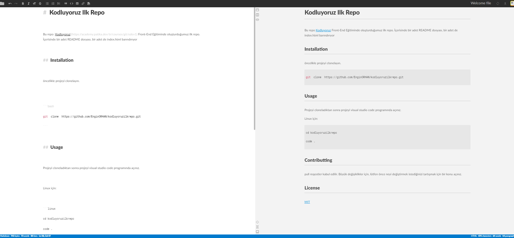

# Kodluyoruz Ilk Repo

Bu repo [Kodluyoruz](https://academy.patika.dev/tr/courses/git/odev1) Front-End Eğitiminde oluşturduğumuz ilk repo. İçerisinde bir adet README dosyası, bir adet de index.html barındırıyor

## Installation

öncelikle projeyi clonelayın.


```bash
git clone https://github.com/EnginORHAN/kodluyoruzilkrepo.git
```

## Usage

Projeyi cloneladıktan sonra projeyi visual studio code programında açınız.

Linux için:

```linux
cd kodluyoruzilkrepo
code .
```

## Contributting
pull reqestler kabul edilir. Büyük değişiklikler için, lütfen önce neyi değiştirmek istediğinizi tartışmak için bir konu açınız.

## License

[MIT](https://choosealicense.com/licenses/mit/)


